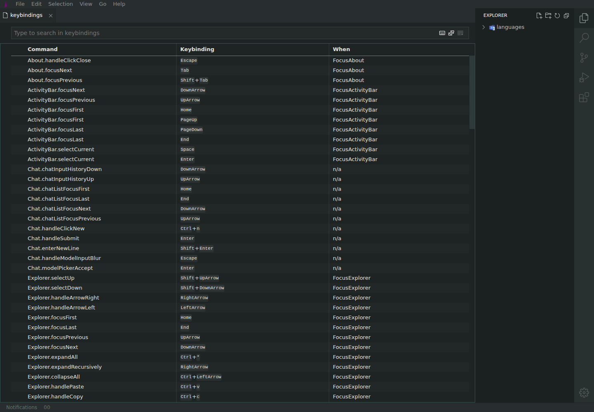
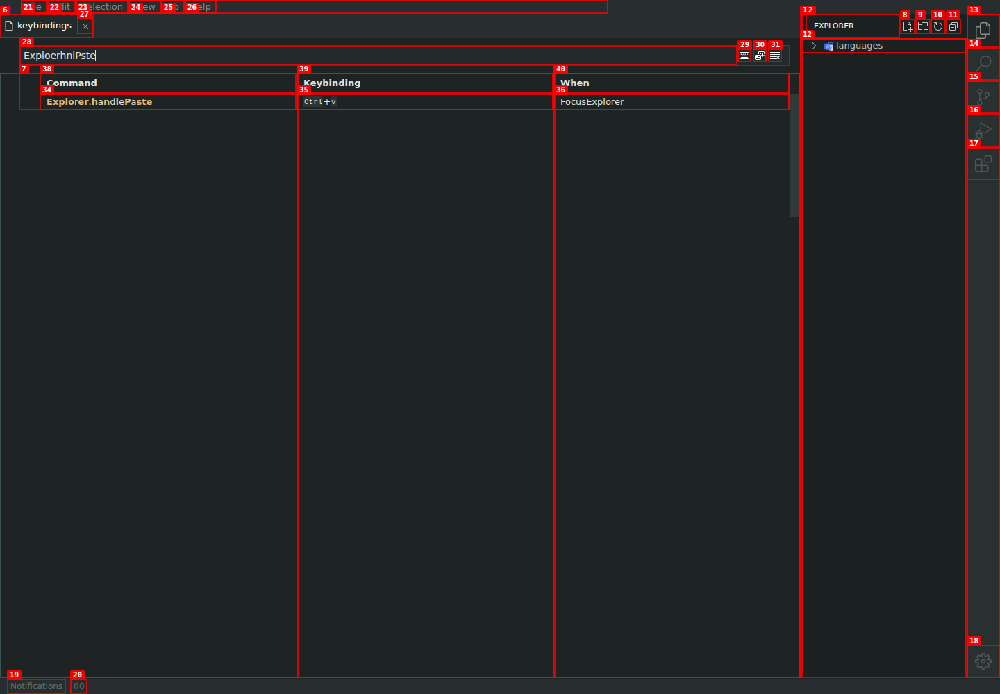

# Filter drops characters during fast typing

| Field       | Value                                           |
| ----------- | ----------------------------------------------- |
| Severity    | Medium                                          |
| Category    | Functional                                      |
| URL         | https://lvce-editor.github.io/keybindings-view/ |
| Repro video | [repro.webm](repro.webm)                        |

## Description

The keybindings filter loses and reorders characters when a query is typed quickly. In the recorded reproduction, typing `Explorer.handlePaste` character by character results in `ExploerhnlPste`.

Expected: every typed character is preserved in order and the input contains `Explorer.handlePaste`.

Actual: multiple characters disappear or move, leaving a corrupted query. Pasting or programmatically replacing the entire value works, so this appears to be a race between input handling and view updates.

The failed updates also emit repeated page errors of the form:

`Cannot navigate to sibling: sibling not found at index {$Parent: tbody.TableBody, index: 1, childCount: 1}`

## Reproduction

1. Open the deployed editor and open the Settings menu.
   
   
2. Select **Keyboard Shortcuts**.
   
3. Focus the search box and quickly type `Explorer.handlePaste`.
4. Observe that the search box contains a shortened, reordered query.
   

## Reproducibility

Reproduced three times with `Explorer.handlePaste` and `About.handleClickClose`; each attempt produced a different corrupted value.

## Resolution

User-originated input is no longer written back to the textbox by the renderer. The browser now owns the live value while the worker updates filtering state. Verified locally by rapidly typing the complete `Explorer.handlePaste` query with no dropped characters or page errors.
