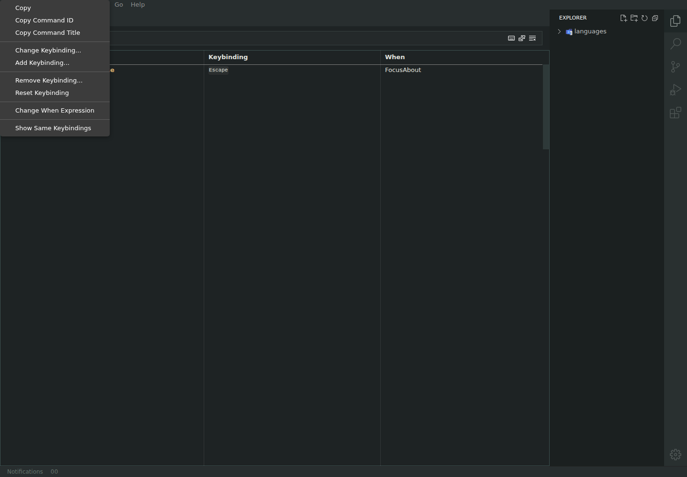
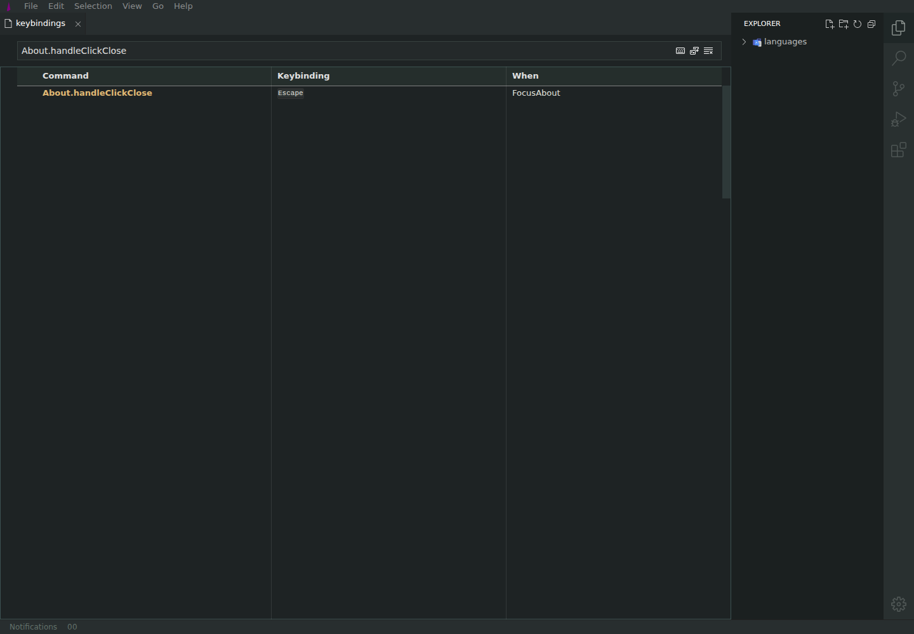
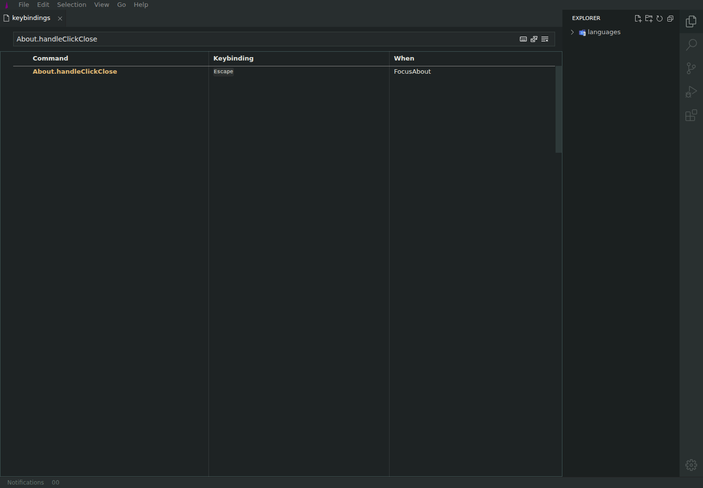
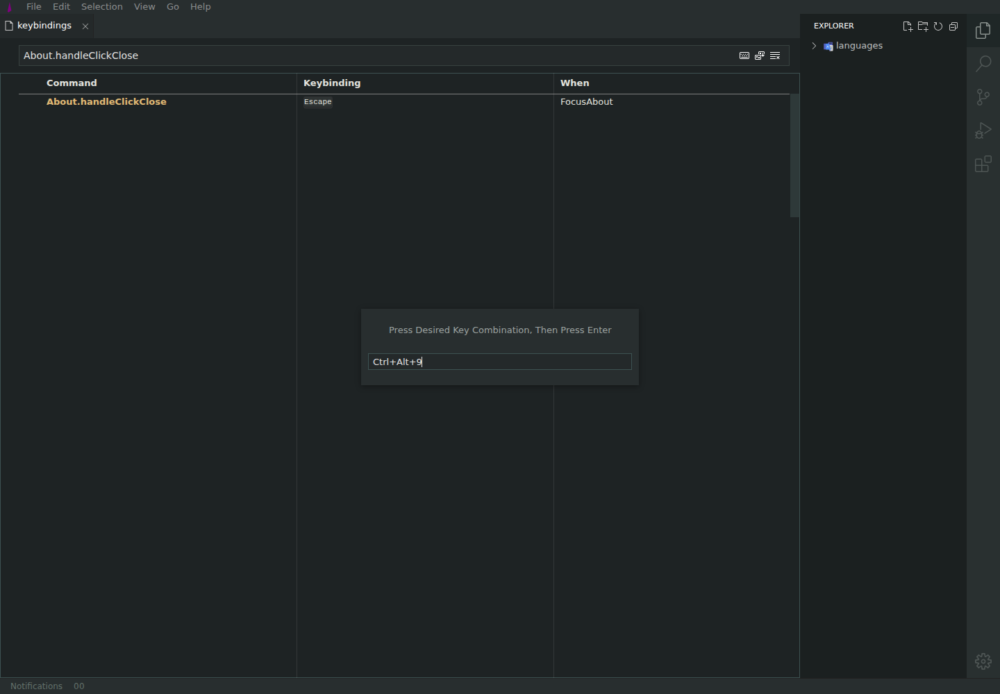
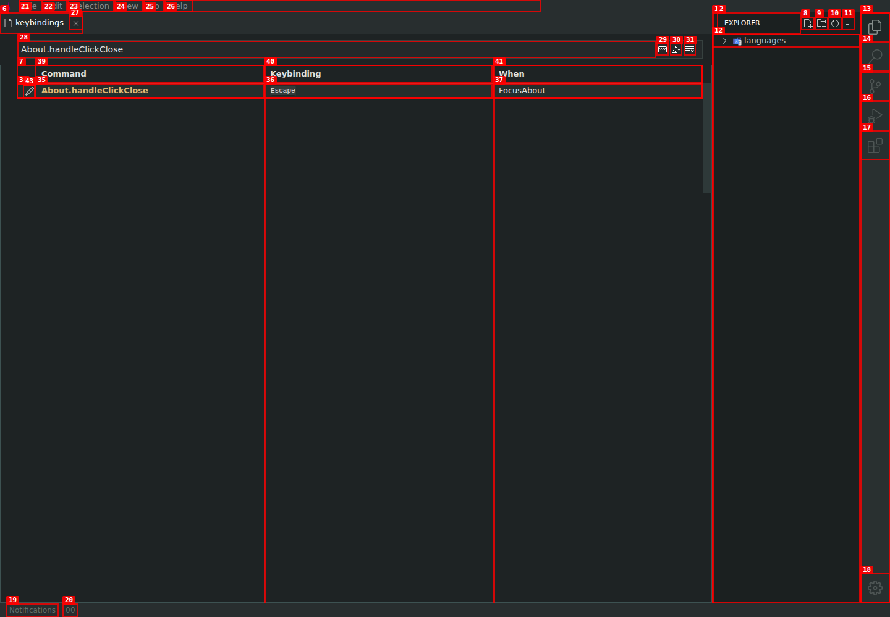

# Keybinding mutations do not apply

| Field       | Value                                           |
| ----------- | ----------------------------------------------- |
| Severity    | High                                            |
| Category    | Functional                                      |
| URL         | https://lvce-editor.github.io/keybindings-view/ |
| Repro video | [repro.webm](repro.webm)                        |

## Description

The three core keybinding mutation paths are non-functional:

- **Add Keybinding...** closes the context menu without opening a capture dialog or adding a row.
- **Remove Keybinding...** closes the context menu but leaves the selected binding unchanged.
- Double-clicking a binding opens the change dialog and captures a replacement shortcut, but pressing Enter closes the dialog without changing the row.

The context-menu **Change Keybinding...** action is also a no-op, although double-clicking the keybinding cell does open the change dialog.

Expected: add creates another user binding, remove disables/removes the selected binding, and change replaces it with the captured shortcut.

Actual: the original System row remains unchanged in every case, with no feedback or error.

## Reproduction

1. Open **Keyboard Shortcuts** and filter for `About.handleClickClose`.
   
2. Open the row context menu.
   
3. Select **Add Keybinding...** and observe that nothing opens or changes.
   
4. Open the context menu again, select **Remove Keybinding...**, and observe that the `Escape` binding remains.
   
5. Double-click `Escape`, press `Ctrl+Alt+9`, then press Enter.
   
6. Observe that the row still shows `Escape`.
   

## Reproducibility

Add and Remove were each reproduced on `About.handleClickClose` and `Chat.handleClickNew`. Change was reproduced on `About.handleClickClose` and `Explorer.handlePaste`, including after clearing the filter and refreshing the page.

## Resolution

Add and Change now open an explicit capture mode, the captured shortcut is
parsed (including Alt), Add creates a `User` binding, Change replaces the
selected row, and Remove deletes it.

The final failure was in the dialog-to-parent handoff across the two
repositories:

- `keybindings-view` now supplies its runtime view UID when opening the capture
  dialog.
- `lvce-editor` 0.94.6 stores that parent UID, resolves numeric runtime UIDs
  correctly, and waits for dialog disposal before completing the Enter command.
- Dedicated browser regressions cover add/remove, change, and showing all
  bindings with the same shortcut.

The exact combined build passed all 64 enabled browser tests, with 6
intentionally skipped and no failures.
