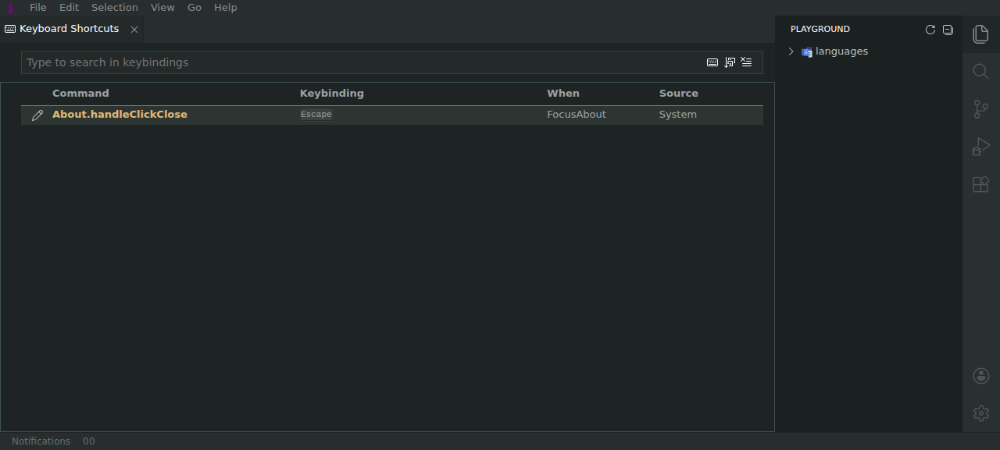

# Keybinding mutations do not persist after reload

| Field    | Value                                           |
| -------- | ----------------------------------------------- |
| Severity | High                                            |
| Category | Functional / data persistence                   |
| URL      | https://lvce-editor.github.io/keybindings-view/ |

## Description

Adding, changing, and removing keybindings updates the open Keyboard Shortcuts
view, but reloading the application discards every mutation and restores the
original System binding.

Expected: user keybinding changes remain effective after an application reload.

Actual: the view reloads the bundled defaults. For example,
`About.handleClickClose` reverts from the changed `Ctrl+Alt+9` User binding to
the original `Escape` System binding.

## Reproduction

1. Open **Keyboard Shortcuts** and filter for `About.handleClickClose`.
2. Change `Escape` to `Ctrl+Alt+9`; observe the row source change to `User`.
3. Add `Ctrl+Shift+8`; observe two User rows.
4. Remove the `Ctrl+Shift+8` row; observe that `Ctrl+Alt+9` remains.
5. Reload the page.
6. Observe that the only row is again `Escape`, with source `System`.

The pre-reload changed, added, and removed states are captured in the sibling
[mutation issue evidence](../keybinding-mutations-do-not-apply/README.md).

## Reproducibility

Reproduced on the deployed v8.8.3 build in a fresh browser session.

## Resolution

Mutations now serialize the raw keybinding set through the existing
`app://keybindings.json` filesystem abstraction. The view loads that stored set
on startup and safely falls back to the bundled defaults when storage is absent
or malformed.

Verified in the deployed build by changing the binding to `Ctrl+Alt+9 / User`,
performing a full page reload, and observing that the User binding was
restored. The QA-created persisted record was removed after verification.
