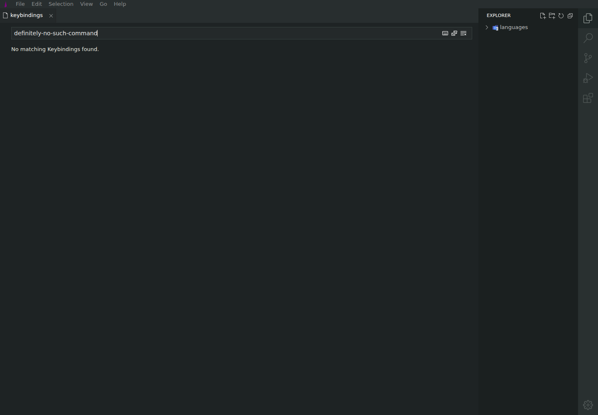

# No-results filter has no empty-state message

| Field       | Value                                           |
| ----------- | ----------------------------------------------- |
| Severity    | Low                                             |
| Category    | UX                                              |
| URL         | https://lvce-editor.github.io/keybindings-view/ |
| Repro video | N/A                                             |

## Description

When a filter has no matches, the entire keybindings table disappears and the view shows an empty area with no explanation. There is no “No keybindings found” message or other feedback that distinguishes a valid empty result from a loading or rendering failure.

Expected: an explicit no-results message is shown while retaining enough table context to make the state clear.

Actual: the content area is blank.

## Reproduction

1. Open **Keyboard Shortcuts**.
2. Enter a query that cannot match a command, such as `definitely-no-such-command`.
3. Observe the blank content area.
   

## Reproducibility

Always reproduced with unmatched command and shortcut queries.

## Resolution

The message now opts out of the shared zero-height strict containment rule. Verified in the built local app: the text is visible and its rendered element has a non-zero height.
