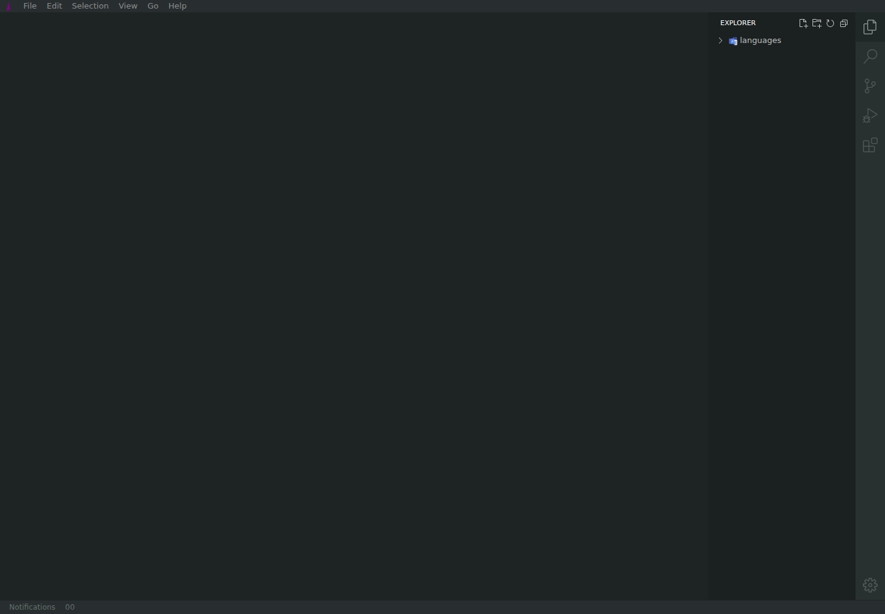
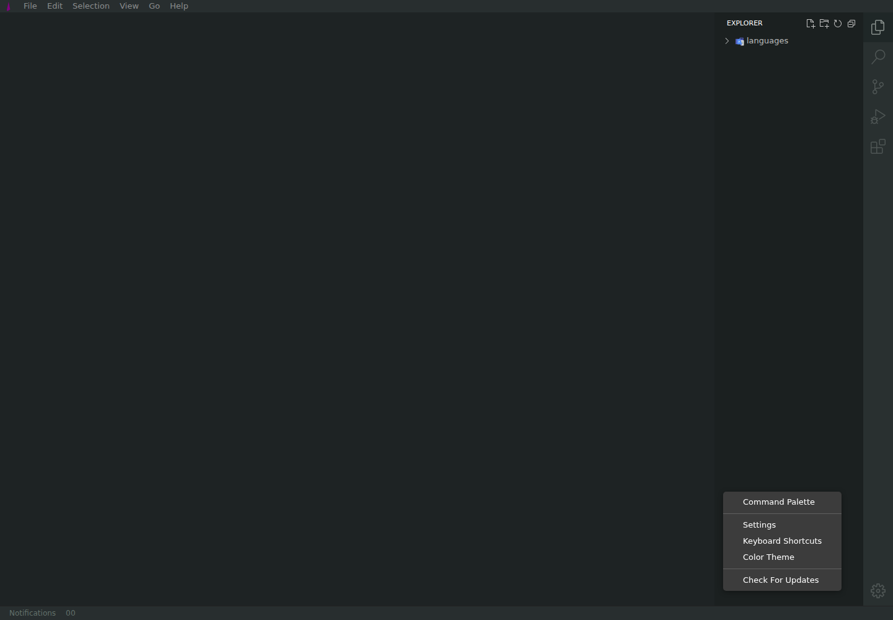
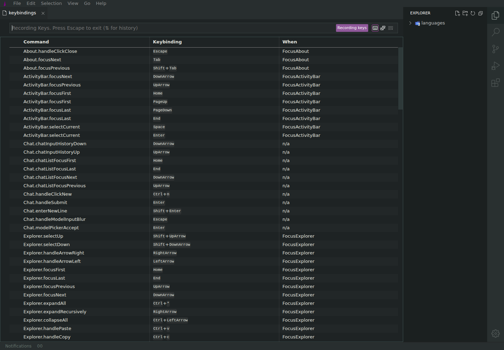
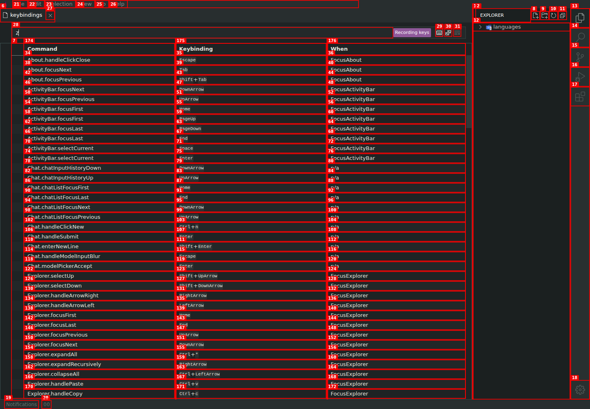
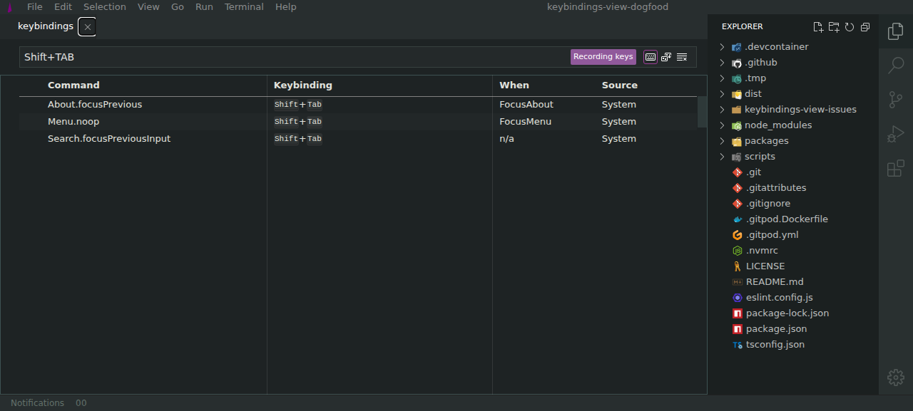

# Record Keys drops shortcut modifiers

| Field       | Value                                           |
| ----------- | ----------------------------------------------- |
| Severity    | High                                            |
| Category    | Functional                                      |
| URL         | https://lvce-editor.github.io/keybindings-view/ |
| Repro video | [repro.webm](repro.webm)                        |

## Description

When **Record keys** is enabled, modified shortcuts are reduced to their base key. For example, pressing `Ctrl+Shift+Z` places `z` in the search box instead of recording `Ctrl+Shift+Z`. The resulting query does not identify bindings that use the pressed shortcut.

Expected: the complete shortcut, including every modifier, is recorded and used to filter the keybindings table.

Actual: only the base key is inserted, with a leading space, and the table remains unfiltered.

## Reproduction

1. Open the deployed editor and open the Settings menu.
   
   
2. Select **Keyboard Shortcuts**.
   
3. Enable **Record keys**.
   
4. Focus the search box and press `Ctrl+Shift+Z`.
5. Observe that the search box contains only `z`, rather than the complete shortcut.
   

## Reproducibility

Reproduced three times with modified shortcuts, including `Ctrl+V` and `Ctrl+Shift+Z`.

## Resolution

The keydown event now forwards Shift, formats the complete Ctrl/Alt/Shift combination, avoids the leading space, and filters by the recorded shortcut. Verified locally with `Ctrl+Shift+Z` and `Shift+Tab`; the latter reduced the table to the three exact matches without console errors. Regression tests cover modifier preservation, special-key casing, and exact filtering.

