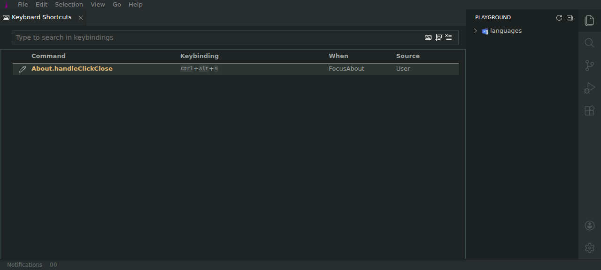
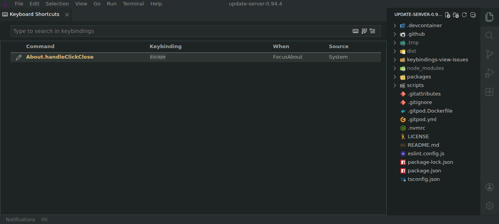

# Reset Keybinding does not restore the default binding

| Field    | Value                                           |
| -------- | ----------------------------------------------- |
| Severity | Medium                                          |
| Category | Functional                                      |
| URL      | https://lvce-editor.github.io/keybindings-view/ |

## Description

The **Reset Keybinding** context-menu action closes the menu but does not
restore a changed User binding to its System default.

Expected: resetting `About.handleClickClose` after changing it restores
`Escape` with source `System`.

Actual: the changed `Ctrl+Alt+9` binding remains with source `User`.

## Reproduction

1. Open **Keyboard Shortcuts** and select `About.handleClickClose`.
2. Change its binding from `Escape` to `Ctrl+Alt+9`.
3. Open the row context menu and select **Reset Keybinding**.
4. Observe that the row remains `Ctrl+Alt+9 / User`.

## Reproducibility

Reproduced on the deployed v8.8.3 build in a fresh browser session.

## Resolution

Reset now removes the selected User binding, reloads defaults for the same
command and context, restores any missing System bindings without duplicating
existing defaults, and persists the result.

Verified in the deployed build by resetting `About.handleClickClose` from
`Ctrl+Alt+9 / User` to `Escape / System`, then performing a full page reload
and observing that the restored System binding remained.

