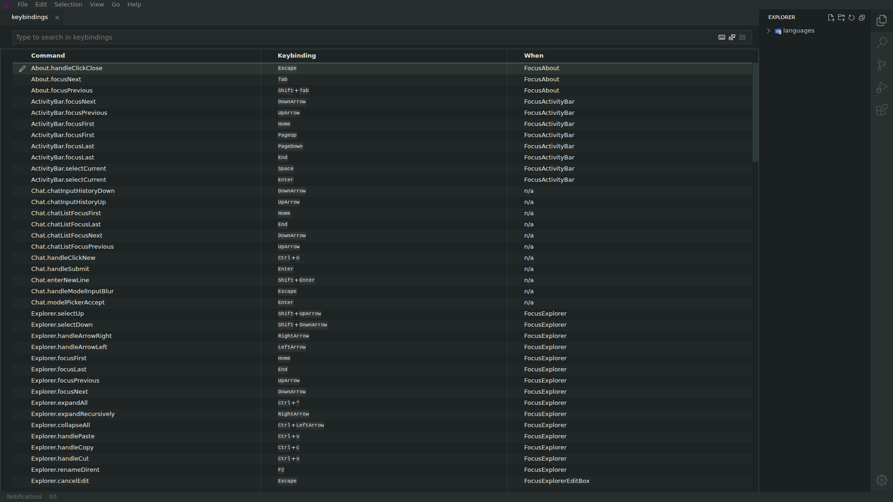
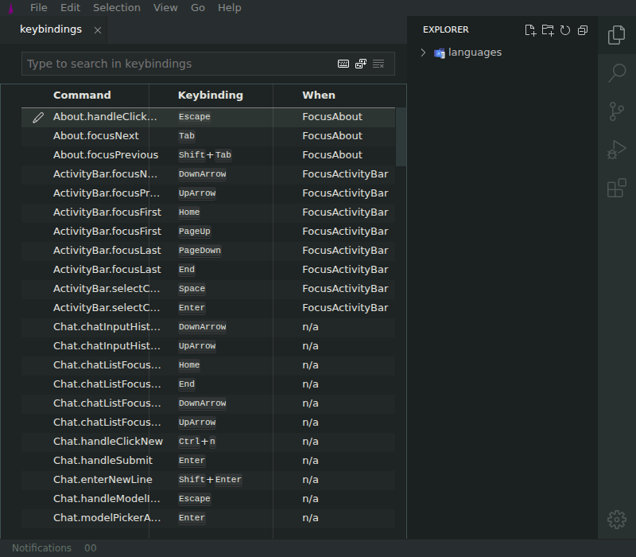

# Source column is never visible

| Field       | Value                                           |
| ----------- | ----------------------------------------------- |
| Severity    | Medium                                          |
| Category    | Visual / Functional                             |
| URL         | https://lvce-editor.github.io/keybindings-view/ |
| Repro video | N/A                                             |

## Description

The keybindings table exposes a fourth **Source** column and source cells such as `System` to the accessibility tree, but the rendered table only shows **Command**, **Keybinding**, and **When**. The Source column remains completely clipped at both 1920-pixel and 800-pixel viewport widths, and horizontal scrolling does not reveal it.

Expected: the Source column is visible, or the table provides a horizontal scrollbar that can reveal it.

Actual: no Source header or values are visible at any tested desktop width.

## Reproduction

1. Open **Keyboard Shortcuts** at a 1920×1080 viewport.
2. Observe that only three table columns are rendered, even though there is ample horizontal space.
   
3. Resize to 800×700.
4. Observe that the Source column remains inaccessible and no horizontal scrollbar appears.
   

## Reproducibility

Always reproduced at 800, 1440, and 1920 pixel viewport widths.

## Resolution

The remaining table width is now explicitly shared between the When and Source columns. The built local app renders the Source header and `System` cells, and the source-column e2e test passes.
